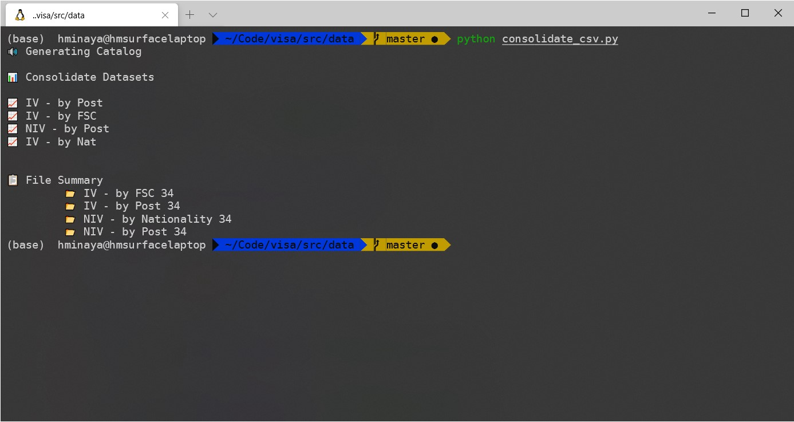

# Visa Issuance Dataset Playground

## Project Organization

    ├── data
    │   ├── catalog                 <- Lookup tables for visa types
    │   ├── raw                     <- 
    │   ├── interim                 <- 
    │   ├── processed               <- 
    │   └── consolidate             <- 
    │    │      
    ├── models                      <- Trained and serialized models, model predictions, or model summaries (WIP)
    │      
    ├── notebooks                   <- Jupyter notebooks. Playground for data, charts, reports
    │      
    ├── requirements.txt            <- The requirements file for reproducing the analysis environment, e.g.
    │                                  generated with `pip freeze > requirements.txt`
    │      
    ├── setup.py                    <- makes project pip installable (pip install -e .) so src can be imported
    └── src                         <- Source code for use in this project.
        │      
        ├── data                    <- Scripts to download and generate data
           │── raw_import.py        <- Imports PDF files from travel.state.gov
           │── pdf_to_csv.py        <- Converts PDF files into CSV
           │── clean_csv.py         <- Cleans up csv files (Code is messy!)
           └── consolidate_csv.py   <- Consolidates data into 4 csv files

## Sample Script

